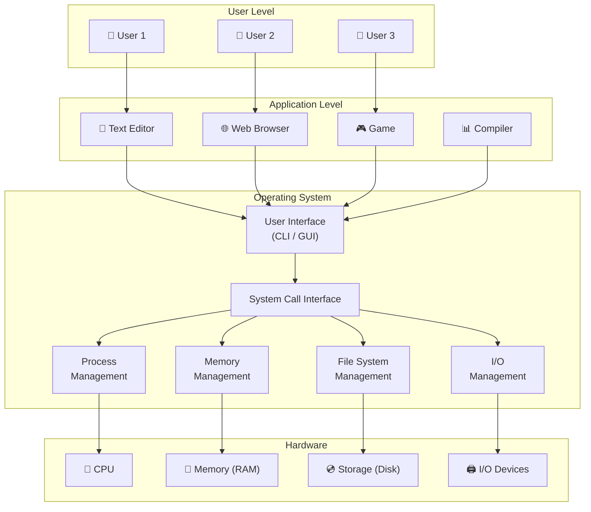
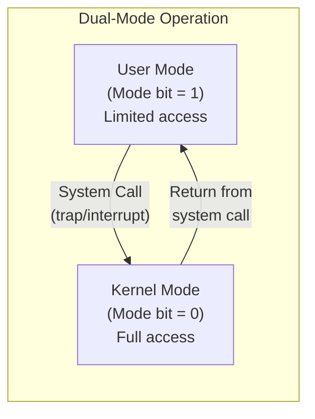
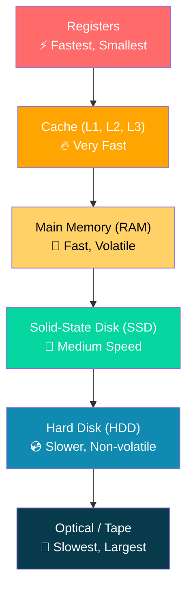

# Operating System Overview

## What is an Operating System?

An **Operating System (OS)** is **system software** that acts as an intermediary between the user and the computer hardware. It manages all hardware and software resources and provides common services for application programs.

> [!tip] Key Definition
> An OS is a program that manages computer hardware, provides a basis for application programs, and acts as an intermediary between the computer user and the computer hardware.

Think of the OS as a **government** — it performs no useful function by itself, but provides an environment within which other programs can do useful work.

---

## Why Do We Need an Operating System?

Without an OS, every programmer would need to write code to directly interact with hardware — managing memory addresses, disk sectors, CPU registers, and device protocols. The OS **abstracts** all of this complexity away.

### Core Reasons

| Reason | Explanation |
|--------|-------------|
| **Abstraction** | Hides complex hardware details from users and applications |
| **Resource Management** | Fairly and efficiently allocates CPU, memory, I/O, and storage |
| **Convenience** | Provides a user-friendly interface (CLI or GUI) to interact with the machine |
| **Efficiency** | Maximizes hardware utilization and system throughput |
| **Protection & Isolation** | Prevents processes from interfering with each other or the OS itself |
| **Security** | Controls access to resources through authentication and authorization |

---

## The OS as a Middle Layer

The OS sits **between applications and hardware**, acting as a resource manager and an extended machine.

> [!warning] Exam Alert
> You may be asked to draw or label the layered architecture of a computer system. Remember the four layers from top to bottom: **Users → Application Programs → Operating System → Hardware**.

### Two Key Views of the OS

| Viewpoint | Description |
|-----------|-------------|
| **Resource Allocator** | Manages and allocates resources (CPU time, memory space, storage, I/O devices) among competing programs and users |
| **Control Program** | Controls execution of user programs to prevent errors and improper use of the computer |

---

## Resource Coordination

The OS coordinates access to **all system resources**. Here's how it handles each:

### 1. CPU Scheduling (Process & CPU Management)

The CPU is the most precious resource. The OS decides **which process runs next** and **for how long**.

- **Multiprogramming** — keeps multiple jobs in memory so the CPU always has something to execute
- **Time-sharing (Multitasking)** — rapidly switches between processes, giving each a time slice, creating the illusion of simultaneous execution
- The **scheduler** selects from ready processes and allocates CPU

> [!tip] Key Point
> The goal of CPU scheduling is to maximize **CPU utilization** and **throughput** while minimizing **waiting time** and **response time**.

### 2. Memory Allocation (Memory Management)

The OS tracks which parts of memory are in use and by whom, decides which processes and data to move in/out of memory, and allocates/deallocates memory dynamically.

- Ensures each process has its own **address space**
- Handles **virtual memory** — allows execution of processes not completely in physical memory
- Protects processes from accessing each other's memory

### 3. File Access (Storage & File Systems)

The OS provides a **uniform, logical view of storage** regardless of the physical medium (HDD, SSD, USB).

- Organizes files into **directories** for easy navigation
- Controls **who can access what** (read, write, execute permissions)
- Manages **free space** and **file allocation** on disk

### 4. Device Drivers & I/O Management

The OS communicates with hardware devices through **device drivers** — specialized software modules.

- Provides a **general device-driver interface** so programs don't need to know hardware specifics
- Manages **buffering** (storing data temporarily during transfer), **caching** (keeping frequently used data in fast memory), and **spooling** (overlapping I/O of one job with computation of other jobs)

### 5. Protection & Isolation

The OS ensures that processes and users do not interfere with one another.

- **Dual-mode operation**: distinguishes between **user mode** (restricted) and **kernel mode** (privileged)
- **Timer interrupts** prevent infinite loops from hogging the CPU
- **Memory protection** prevents one process from accessing another's memory
- **File protection** controls access based on user identity

> [!warning] Exam Alert
> Understanding **dual-mode operation** is critical. The hardware provides a **mode bit** (0 = kernel, 1 = user). Privileged instructions can only execute in kernel mode. A system call triggers a **trap** that switches to kernel mode.

---

## User Interfaces: CLI vs GUI

The OS provides interfaces for users to interact with the system:

| Feature | CLI (Command-Line Interface) | GUI (Graphical User Interface) |
|---------|-----|-----|
| **Interaction** | Text commands typed by user | Mouse/touch with windows, icons, menus |
| **Implemented via** | Shell (bash, zsh, PowerShell, cmd) | Desktop environment (Windows Explorer, GNOME, macOS Finder) |
| **Speed** | Faster for experienced users | Easier for beginners |
| **Scripting** | Supports powerful scripting/automation | Limited automation |
| **Resource Usage** | Lightweight | Heavier (graphics rendering) |
| **Example** | `ls -la /home/user/` | Double-click a folder icon |

> [!tip] Key Point
> The **shell** is the CLI program that interprets commands. It is **not** part of the kernel — it is a system program that uses system calls to interact with the OS.

---

## Key OS Features

### Multi-user Systems
Allow **multiple users** to access the computer simultaneously, each with their own session, files, and permissions. The OS must handle **protection** and **resource allocation** among users.

### Multitasking (Time-sharing)
Allows **multiple processes** to share the CPU by rapidly switching between them. Each process gets a small **time quantum** (time slice). Gives the illusion that all programs run simultaneously.

```mermaid
gantt
    title CPU Time-Sharing Between Processes
    dateFormat X
    axisFormat %s

    section Process A
    Running: 0, 3
    Waiting: 3, 6
    Running: 6, 9

    section Process B
    Waiting: 0, 3
    Running: 3, 6
    Waiting: 6, 9

    section Process C
    Waiting: 0, 6
    Running: 9, 12
```

### Multiprocessing
Uses **multiple CPUs/cores** to execute processes **truly in parallel**. Unlike multitasking (which interleaves on one CPU), multiprocessing achieves real simultaneous execution.

| Aspect | Multitasking | Multiprocessing |
|--------|-------------|----------------|
| CPUs | Single CPU (or core) | Multiple CPUs/cores |
| Execution | Interleaved (concurrent) | Truly parallel |
| Goal | Maximize CPU utilization | Increase throughput |

### Multithreading
A single process can have **multiple threads** of execution sharing the same address space and resources but running different parts of the code.

- Threads within a process share: code, data, open files
- Each thread has its own: program counter, registers, stack
- Advantage: **lightweight** context switching (cheaper than process switching)

---

## Computer System Organization

### Interrupt-Driven Operation

Modern operating systems are **interrupt-driven**. When the CPU has no work, it sits idle — hardware interrupts wake it up.

| Interrupt Type | Trigger | Example |
|---------------|---------|---------|
| **Hardware Interrupt** | External device signals CPU | Keyboard press, disk I/O complete, timer tick |
| **Software Interrupt (Trap)** | Program instruction | System call, division by zero, invalid memory access |

> [!tip] Key Point
> An **interrupt vector** is a table of addresses pointing to interrupt service routines (ISRs). When an interrupt occurs, the CPU uses the interrupt number to index into this table and jump to the correct handler.

### Storage Hierarchy

> Speed and cost **decrease** going down; capacity **increases** going down.

---

## Practice Questions

### Conceptual Questions

1. **Define** an operating system and explain its two main roles (resource allocator and control program).

2. **Explain** why we need an operating system. What would happen if applications had to interact directly with hardware?

3. **Draw** the layered architecture of a computer system and label each layer.

4. **Compare and contrast** CLI and GUI interfaces. Give one advantage of each.

5. **Distinguish** between multitasking, multiprocessing, and multithreading with examples.

6. **Explain** dual-mode operation. Why is it necessary? What is the role of the mode bit?

7. **What** is the purpose of interrupts? Differentiate between hardware and software interrupts.

8. **Describe** the storage hierarchy. Why do we need multiple levels of storage?

### True or False

| Statement | Answer |
|-----------|--------|
| The OS is the first program loaded when a computer starts | ❌ False — the **bootstrap program** (firmware/BIOS) loads first, which then loads the OS |
| In user mode, a process can execute any CPU instruction | ❌ False — privileged instructions are only available in kernel mode |
| Multitasking requires multiple CPUs | ❌ False — multitasking can work on a single CPU via time-sharing |
| The shell is part of the kernel | ❌ False — the shell is a system program, not part of the kernel |
| Interrupts are the primary mechanism for the OS to regain control of the CPU | ✅ True |

> [!warning] Exam Alert
> A classic exam question: **"What is the purpose of the mode bit?"** — Answer: It distinguishes between user mode and kernel mode execution to protect the OS from errant/malicious user programs. Only in kernel mode can privileged instructions (like I/O operations, halting the CPU, modifying interrupt vectors) be executed.
