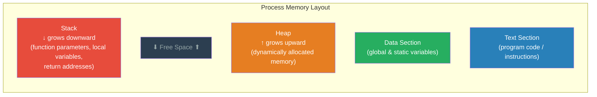
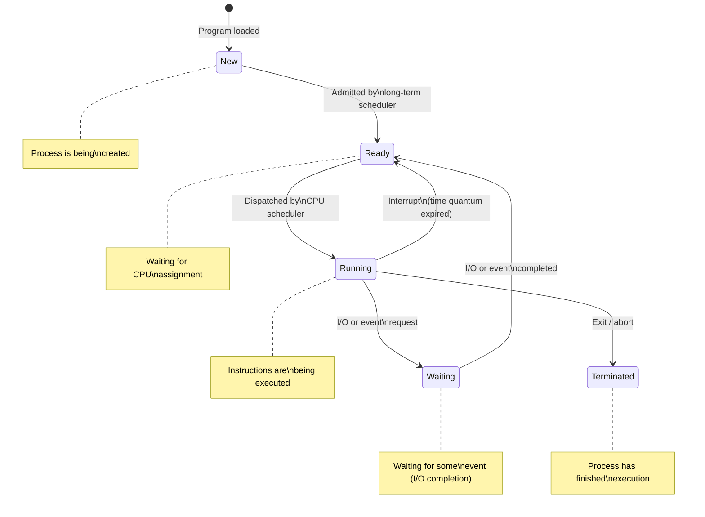
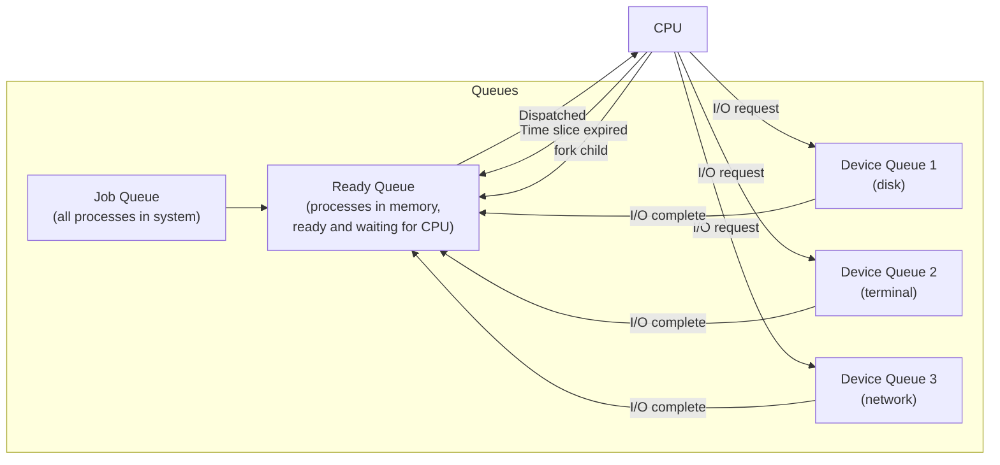
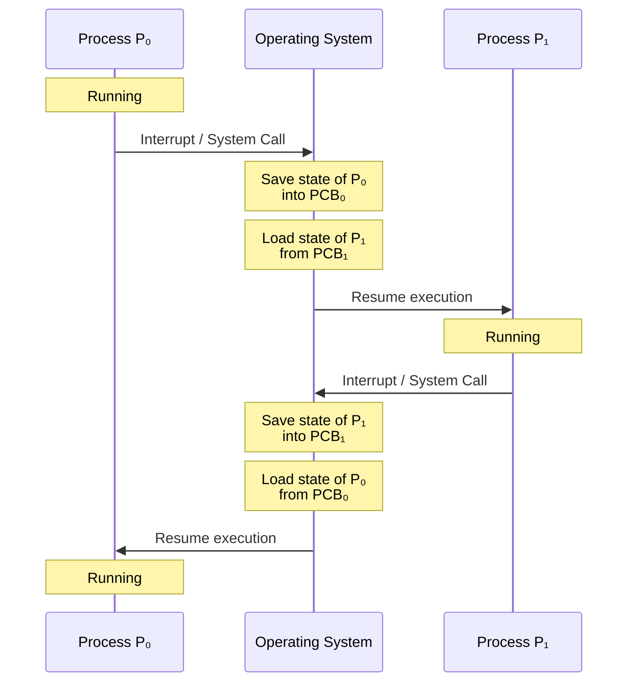
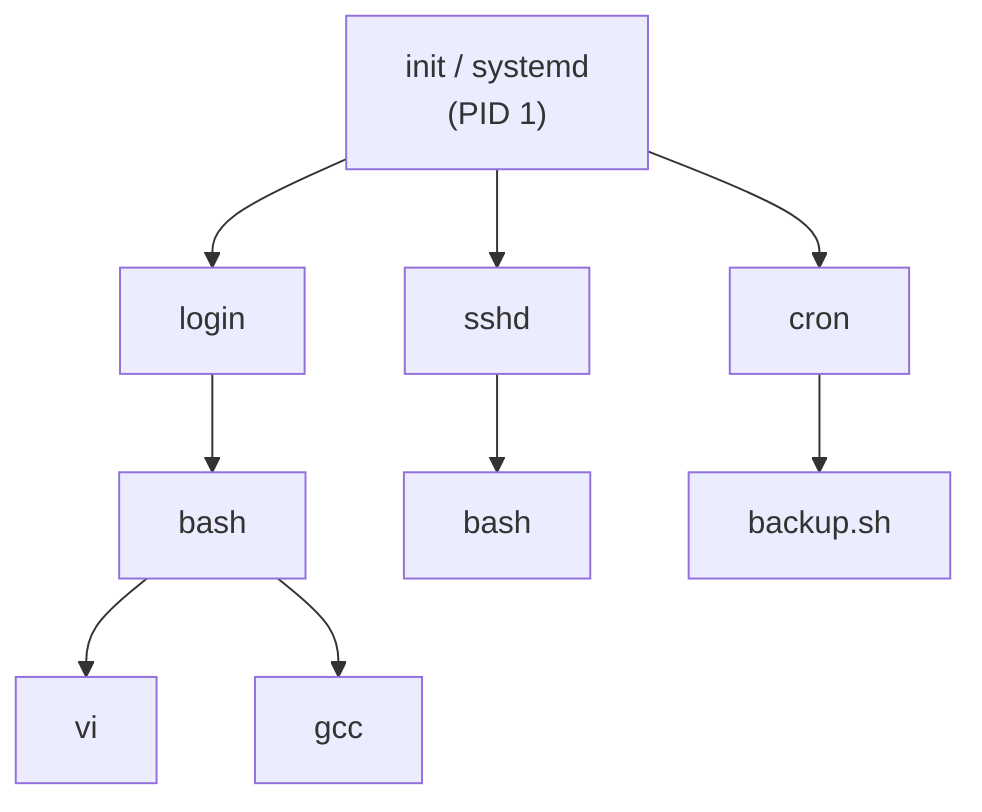
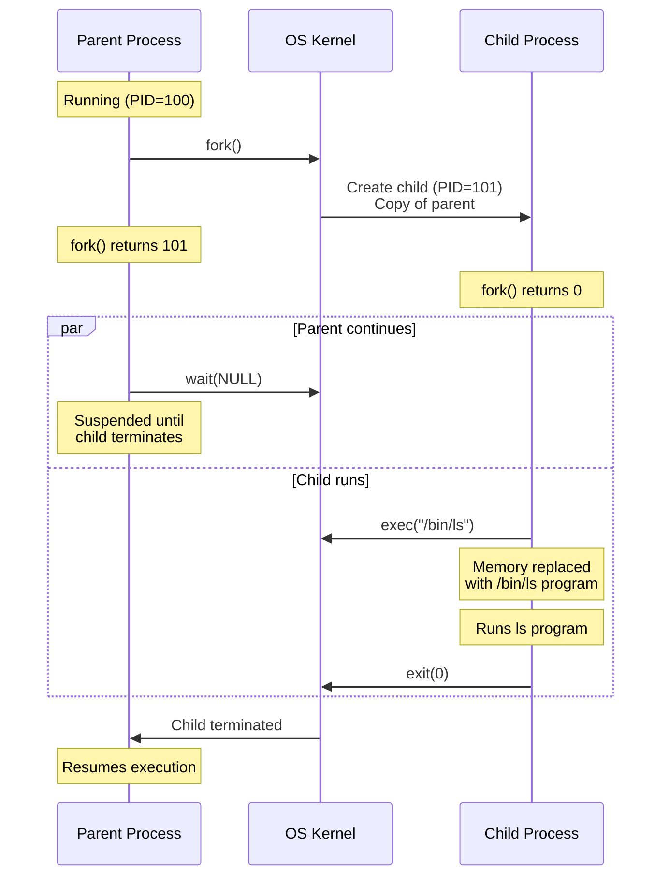

# Processes

## What is a Process?

A **process** is a **program in execution**. It is the fundamental unit of work in an operating system. While a program is a **passive** entity (a file on disk), a process is an **active** entity with a program counter, resources, and a current state.

> [!tip] Key Definition
> **Program** = passive entity (executable file stored on disk)
> **Process** = active entity (program loaded into memory and executing, with its own resources and state)

A program becomes a process when the executable file is **loaded into memory**.

### Process in Memory

A process's memory layout is divided into several sections:



| Section | Contents | Size |
|---------|----------|------|
| **Text** | The compiled program code (machine instructions) | Fixed |
| **Data** | Global and static variables | Fixed |
| **Heap** | Memory dynamically allocated at runtime (`malloc`, `new`) | Variable (grows upward) |
| **Stack** | Temporary data: function parameters, return addresses, local variables | Variable (grows downward) |

> [!warning] Exam Alert
> Know the four sections of process memory. The **stack** and **heap** grow toward each other. If they meet, you get a **stack overflow** or **heap overflow** error.

---

## Process States

A process transitions through several states during its lifetime:



### The Five Process States

| State | Description |
|-------|-------------|
| **New** | The process is being created (loading executable, allocating resources) |
| **Ready** | The process is loaded in memory, has all resources except CPU, and is waiting to be assigned to a processor |
| **Running** | Instructions are being executed on the CPU. **Only one process per CPU core** can be in this state |
| **Waiting (Blocked)** | The process is waiting for some event to occur (I/O completion, signal, resource availability) |
| **Terminated** | The process has finished execution. Resources are being deallocated |

### Key Transitions

| Transition | Cause |
|-----------|-------|
| New → Ready | OS admits the process (long-term scheduler) |
| Ready → Running | CPU scheduler **dispatches** the process (short-term scheduler) |
| Running → Ready | **Interrupt** occurs (e.g., time quantum expired — preemption) |
| Running → Waiting | Process initiates **I/O request** or waits for an event |
| Waiting → Ready | **I/O completes** or waited event occurs |
| Running → Terminated | Process calls `exit()` or is killed/aborted |

> [!tip] Key Point
> There is **no direct transition** from Waiting to Running. A process that finishes waiting goes to Ready first, then must be scheduled again to run.

---

## Process Control Block (PCB)

The **Process Control Block (PCB)** — also called **Task Control Block (TCB)** — is a data structure maintained by the OS for every process. It is the OS's representation of a process.

```mermaid
graph TB
    subgraph "Process Control Block (PCB)"
        direction TB
        PID["Process ID (PID)"]
        PS["Process State\n(new/ready/running/waiting/terminated)"]
        PC["Program Counter\n(address of next instruction)"]
        REG["CPU Registers\n(accumulator, index, stack pointer, etc.)"]
        SI["CPU Scheduling Info\n(priority, pointers to scheduling queues)"]
        MMI["Memory Management Info\n(base/limit registers, page tables)"]
        AI["Accounting Info\n(CPU time used, time limits, job/process number)"]
        IOI["I/O Status Info\n(list of open files, allocated I/O devices)"]
    end

    style PID fill:#e74c3c,color:#fff
    style PS fill:#e67e22,color:#fff
    style PC fill:#f1c40f,color:#000
    style REG fill:#2ecc71,color:#fff
    style SI fill:#1abc9c,color:#fff
    style MMI fill:#3498db,color:#fff
    style AI fill:#9b59b6,color:#fff
    style IOI fill:#e91e63,color:#fff
```



### PCB Fields Explained

| Field | Description | Why It Matters |
|-------|-------------|----------------|
| **Process State** | Current state (new, ready, running, waiting, terminated) | OS needs to know what the process is doing |
| **Program Counter** | Address of the next instruction to execute | When process resumes, CPU must know where to continue |
| **CPU Registers** | Contents of all process-relevant registers | Must be saved/restored during context switch |
| **CPU Scheduling Info** | Process priority, pointers to scheduling queues, scheduling parameters | Determines when and how the process gets CPU time |
| **Memory Management Info** | Base and limit registers, page tables, segment tables | Defines the process's address space |
| **Accounting Info** | CPU time used, elapsed real time, time limits, process numbers | For billing, performance monitoring, scheduling decisions |
| **I/O Status Info** | List of I/O devices allocated, list of open files | OS must track all resources the process is using |

> [!warning] Exam Alert
> The PCB is one of the most commonly tested topics. Be ready to list and explain **all fields** of the PCB. Remember: the PCB is the **single most important data structure** in the OS — it contains everything the OS needs to manage a process.

---

## Process Scheduling

The objective of **multiprogramming** is to have some process running at all times to maximize CPU utilization. The objective of **time sharing** is to switch the CPU among processes so frequently that users can interact with each program while it is running.

### Scheduling Queues



| Queue | Description |
|-------|-------------|
| **Job Queue** | Set of **all processes** in the system |
| **Ready Queue** | Set of processes residing in **main memory**, ready and waiting to execute |
| **Device Queues** | Set of processes waiting for a particular **I/O device** |

### Types of Schedulers

| Scheduler | Also Called | Frequency | Role |
|-----------|-----------|-----------|------|
| **Long-term Scheduler** | Job scheduler | Infrequent (seconds/minutes) | Selects processes from job pool to bring into memory (controls **degree of multiprogramming**) |
| **Short-term Scheduler** | CPU scheduler | Very frequent (milliseconds) | Selects from ready queue which process to execute next on CPU |
| **Medium-term Scheduler** | Swapping | As needed | **Swaps** processes in/out of memory to manage degree of multiprogramming |

> [!tip] Key Point
> The **long-term scheduler** controls the **mix** of CPU-bound and I/O-bound processes. A good mix leads to better system performance.
>
> - **I/O-bound process** — spends more time doing I/O than computations (many short CPU bursts)
> - **CPU-bound process** — spends more time doing computations (few very long CPU bursts)

---

## Context Switching

When the CPU switches from one process to another, the OS must **save the state** of the old process and **load the saved state** of the new process. This is called a **context switch**.



### Key Points About Context Switching

| Aspect | Detail |
|--------|--------|
| **What is saved?** | Process state, program counter, CPU registers, memory management info — everything in the PCB |
| **Where is it saved?** | In the process's PCB in kernel memory |
| **Is it useful work?** | **No!** Context switch time is **pure overhead** — the system does no useful work while switching |
| **Duration** | Typically 1–1000 microseconds, depends on hardware support |
| **Speed depends on** | Hardware (number of registers to save), OS complexity, memory speed |

> [!warning] Exam Alert
> **Context switch time is overhead.** It depends on hardware support (e.g., some CPUs have multiple sets of registers, making switching faster). This is a frequently tested concept.

---

## Process Creation

### The Parent-Child Relationship

Processes can create new processes. The creating process is the **parent**, and the created process is the **child**. This forms a **process tree**.



### Process Identification

- Each process has a unique **Process Identifier (PID)** — an integer number
- The **init** process (PID 1) is the root of all user processes in UNIX/Linux
- `pid_t` data type is used to store PIDs in UNIX

### Options When Creating a Child Process

| Aspect | Option 1 | Option 2 |
|--------|----------|----------|
| **Execution** | Parent and child execute **concurrently** | Parent **waits** until child terminates |
| **Address Space** | Child is a **duplicate** of parent (same program and data) | Child has a **new program** loaded into it |

### fork() and exec()

The **`fork()`** system call creates a new (child) process that is an **exact copy** of the parent.

```
// fork() return values:
// - Returns 0 to the CHILD process
// - Returns child's PID (> 0) to the PARENT process
// - Returns -1 on error

pid_t pid = fork();

if (pid < 0) {
    // Error: fork failed
} else if (pid == 0) {
    // Child process executes here
    exec("/bin/ls");  // Replace child's memory with new program
} else {
    // Parent process executes here
    // pid contains the child's PID
    wait(NULL);  // Wait for child to finish
}
```

> [!tip] Key Point
> After `fork()`:
> - **Two processes** exist — parent and child
> - Both continue execution from the instruction **after** the fork
> - They are distinguished by the **return value** of fork()
> - The child is an **exact copy** of the parent (same code, data, open files, etc.)

**`exec()`** replaces the current process's memory space with a **new program**. The process ID remains the same.



### fork() Example Walkthrough

```
#include <stdio.h>
#include <unistd.h>
#include <sys/wait.h>

int main() {
    pid_t pid;

    pid = fork();      // Create child process

    if (pid < 0) {     // Error
        fprintf(stderr, "Fork Failed\n");
        return 1;
    }
    else if (pid == 0) {   // Child process
        printf("I am the child, PID = %d\n", getpid());
        execlp("/bin/ls", "ls", NULL);  // Execute ls
    }
    else {                 // Parent process
        printf("I am the parent, PID = %d, Child PID = %d\n",
               getpid(), pid);
        wait(NULL);        // Wait for child to complete
        printf("Child has finished\n");
    }
    return 0;
}
```

> [!warning] Exam Alert
> A very common exam question: **"How many processes are created by the following code?"** with nested `fork()` calls. Remember: each `fork()` doubles the number of processes. So `n` sequential fork calls create **2ⁿ** total processes. Be careful with conditional forks!

### How Many Processes? — Common Pattern

```
fork();    // 1 → 2 processes
fork();    // 2 → 4 processes
fork();    // 4 → 8 processes
// Total: 8 processes (2³)
// New processes created: 7 (2³ - 1)
```

---

## Process Termination

A process terminates when it finishes its last statement and asks the OS to delete it using `exit()`.

### Normal Termination
- Process executes its last statement and calls **`exit(status)`**
- Status value is returned to the parent via **`wait(&status)`**
- All resources (memory, open files, I/O buffers) are **deallocated** by the OS

### Abnormal Termination (Parent Kills Child)

A parent may terminate a child process using the **`abort()`** or **`kill()`** system call. Reasons include:

| Reason | Explanation |
|--------|-------------|
| Resource exceeded | Child has exceeded allocated resources |
| Task no longer needed | The task assigned to child is no longer required |
| Parent is terminating | Some OSes don't allow child to continue if parent terminates (**cascading termination**) |

### Zombie and Orphan Processes

| Type | Definition | Cause |
|------|-----------|-------|
| **Zombie** | A process that has terminated but whose parent has **not yet called `wait()`** | Parent hasn't collected exit status — entry remains in process table |
| **Orphan** | A process whose parent has **terminated** before it | Parent exits without waiting — child is adopted by `init` (PID 1) |

> [!tip] Key Point
> **Zombies** consume a process table entry (PID, exit status). They're cleaned up when the parent calls `wait()`. If a parent never calls `wait()`, zombies accumulate and can exhaust the process table.
>
> **Orphans** in UNIX are re-parented to the **init** process, which periodically calls `wait()` to clean them up.

---

## Summary Table

| Concept | Key Details |
|---------|------------|
| **Process** | Program in execution with own memory space and resources |
| **Process States** | New → Ready → Running → Waiting → Terminated |
| **PCB** | Contains: state, PC, registers, scheduling info, memory info, accounting, I/O status |
| **Context Switch** | Save old PCB, load new PCB — pure overhead |
| **Schedulers** | Long-term (job), short-term (CPU), medium-term (swapping) |
| **fork()** | Creates child as copy of parent; returns 0 to child, PID to parent |
| **exec()** | Replaces process memory with new program; PID unchanged |
| **Zombie** | Terminated child, parent hasn't called wait() |
| **Orphan** | Child still running, parent has terminated |

---

## Practice Questions

### Conceptual Questions

1. **Define** a process and explain how it differs from a program.

2. **Draw** the process state diagram and label all five states and all transitions between them.

3. **List** all the fields in a PCB and explain the purpose of each.

4. **Explain** what happens during a context switch. Why is it considered overhead?

5. **What** is the difference between the long-term scheduler and the short-term scheduler?

6. **Trace** the execution of a program with `fork()`. What are the possible outputs?

7. **Explain** the difference between a zombie process and an orphan process. How does UNIX handle each?

8. **How many** processes are created by the following code?
   ```
   fork();
   fork();
   fork();
   ```

### Quick Quiz

| Question | Answer |
|----------|--------|
| What is the maximum number of processes in "Running" state on a single-core CPU? | **1** |
| Can a process go directly from Waiting to Running? | **No** — it must go through Ready first |
| What does `fork()` return to the child process? | **0** |
| What does `fork()` return to the parent process? | **Child's PID** (positive integer) |
| What system call does a parent use to wait for a child to finish? | **`wait()`** |
| What replaces the address space of a process with a new program? | **`exec()`** |
| Three sequential `fork()` calls create how many total processes? | **8** (2³) |
| What structure stores all information about a process? | **PCB (Process Control Block)** |

> [!warning] Exam Alert
> Process state diagrams are **extremely popular** in exams. Practice drawing the diagram from memory, including all five states and all valid transitions with their causes. Remember: there is **no arrow from Waiting directly to Running**.
