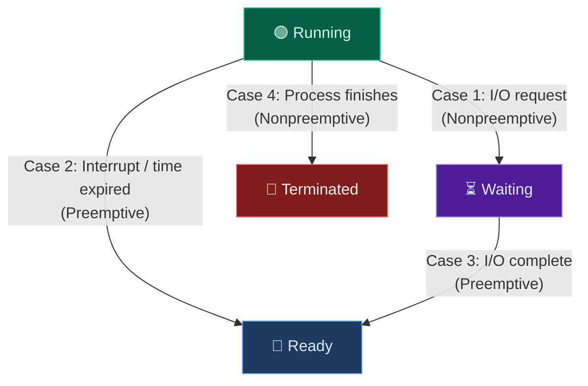
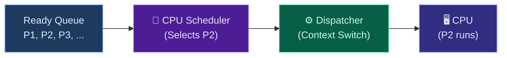

## 1. Basic Concepts

### The CPU–I/O Burst Cycle

Every process alternates between two states of activity in a repeating cycle:

1. **CPU Burst** — The process is actively executing instructions on the CPU
2. **I/O Burst** — The process is waiting for an I/O operation to complete (disk read, network request, user input, etc.)

A process begins with a **CPU burst**, followed by an **I/O burst**, then another CPU burst, and so on. The final CPU burst ends with a system request to **terminate** execution.

> [!tip] Burst Duration Distribution
> Most processes have **many short CPU bursts** and **few long CPU bursts**. This distribution is important because scheduling algorithms can exploit it — for example, giving priority to processes with short bursts (SJF).

### How Multiprogramming Maximizes CPU Utilization

**Problem:** When a process performs I/O, the CPU sits **idle** — wasting expensive processing time.

**Solution — Multiprogramming:** Keep **multiple processes in memory** simultaneously. When the current process begins an I/O burst, the CPU **immediately switches** to another process from the ready queue. This way, the CPU is **never idle** as long as there are ready processes.

> [!important] Core Idea
> The goal of multiprogramming is to have some process running **at all times** to maximize CPU utilization (target: **40%–90%** utilization depending on system type).

---

## 2. The CPU Scheduler (Short-Term Scheduler)

The **CPU Scheduler** (also called the **Short-Term Scheduler**) is the OS component responsible for:

1. **Selecting** a process from the **ready queue** (processes that are in memory and ready to execute)
2. **Allocating** the CPU to that selected process

The ready queue can be organized in different ways depending on the scheduling algorithm:
* **FIFO Queue** — First-Come, First-Served
* **Priority Queue** — Ordered by priority value
* **Tree Structure** — For efficient minimum-finding (e.g., SJF)
* **Unordered Linked List** — Simple but requires scanning

---

## 3. When Does CPU Scheduling Happen?

CPU scheduling decisions take place under **four circumstances**:

| Case | Transition | Type | Explanation |
| :--- | :--- | :--- | :--- |
| **1** | Running → Waiting | **Nonpreemptive** | Process requests I/O — it **voluntarily** gives up the CPU |
| **2** | Running → Ready | **Preemptive** | A higher-priority process arrives OR time quantum expires — the CPU is **taken away** |
| **3** | Waiting → Ready | **Preemptive** | I/O completes, process returns to ready queue — may preempt current process if higher priority |
| **4** | Process Terminates | **Nonpreemptive** | Process finishes execution — **must** select a new process |

---

## 4. Preemptive vs Nonpreemptive Scheduling

| Aspect | Nonpreemptive (Cooperative) | Preemptive |
| :--- | :--- | :--- |
| **CPU Release** | Process **voluntarily** releases CPU (I/O or termination) | OS **forcefully** takes CPU away from process |
| **When it applies** | Cases 1 & 4 only | Cases 1, 2, 3 & 4 |
| **Starvation Risk** | Low (processes finish naturally) | Possible if poorly designed |
| **Responsiveness** | ❌ Poor — a long process monopolizes CPU | ✅ Good — ensures fair time sharing |
| **Complexity** | Simple — no need for timers or preemption logic | Complex — requires timer interrupts & careful synchronization |
| **Race Conditions** | Minimal — only one process modifies data at a time | Higher risk — process can be interrupted mid-update |
| **Used in** | Old batch systems, simple embedded systems | All modern OSes (Windows, Linux, macOS) |

> [!warning] Preemption and Shared Data
> With preemptive scheduling, a process can be interrupted **while updating shared data**, leaving it in an inconsistent state. This is why modern OSes need mechanisms like **mutexes**, **semaphores**, and **locks** to protect critical sections.

---

## 5. The Dispatcher

The **Dispatcher** is the OS module that gives **control of the CPU** to the process selected by the CPU scheduler. It is the component that actually performs the switch.

### Dispatcher Steps

1. **Context Switching** — Save the state (PCB) of the currently running process, then load the saved state of the selected process
2. **Switching to User Mode** — The CPU was in kernel mode during the scheduling decision; the dispatcher switches it back to user mode
3. **Jumping to the Correct Location** — Set the program counter to the correct instruction in the new process (where it left off, or the entry point if it's a new process)

### Dispatch Latency

**Dispatch Latency** = the time it takes for the dispatcher to stop one process and start another. This is **pure overhead** — no useful work is being done during this time.

> [!important] Dispatch Latency
> Dispatch latency should be **as short as possible**. It occurs on every context switch, so even small delays accumulate significantly. Typical latency is a few **microseconds**.

---

## 6. Scheduler vs Dispatcher

These two are often confused. Here is the key difference:

| Component | CPU Scheduler | Dispatcher |
| :--- | :--- | :--- |
| **Role** | **Decides** which process runs next | **Performs** the actual switch to that process |
| **Analogy** | The manager who picks which worker goes next | The person who physically hands the tools to the worker |
| **Involves** | Running the scheduling algorithm (FCFS, SJF, RR, etc.) | Context switch + mode switch + jump |
| **Overhead** | Algorithm computation time | Dispatch latency |

---

## 7. Scheduling Criteria

How do we evaluate whether a scheduling algorithm is good? These are the five key metrics:

| Criterion | Goal | Definition |
| :--- | :--- | :--- |
| **CPU Utilization** | 🔺 Maximize | Percentage of time the CPU is busy (ideal: **40%–90%**) |
| **Throughput** | 🔺 Maximize | Number of processes **completed** per unit time |
| **Turnaround Time** | 🔻 Minimize | Total time from process submission to completion |
| **Waiting Time** | 🔻 Minimize | Total time a process spends **waiting in the ready queue** |
| **Response Time** | 🔻 Minimize | Time from submission until the **first response** is produced |

### Key Formulas

$$
\text{Turnaround Time} = \text{Completion Time} - \text{Arrival Time}
$$

$$
\text{Waiting Time} = \text{Turnaround Time} - \text{Burst Time}
$$

$$
\text{Response Time} = \text{First Response Time} - \text{Arrival Time}
$$

> [!tip] Exam Strategy
> In exam problems, you are usually asked to calculate **Average Waiting Time** and **Average Turnaround Time** for a given set of processes under a specific scheduling algorithm. Always:
> 1. Draw the **Gantt chart** first
> 2. Calculate **completion time** for each process from the Gantt chart
> 3. Apply the formulas above
> 4. Average = sum of all values ÷ number of processes

### What Each Metric Measures

**CPU Utilization** — Are we keeping the CPU busy? A utilization of 40% means the CPU is idle 60% of the time (wasteful). Real-time systems aim for ~90%.

**Throughput** — How many jobs do we finish? A system completing 10 processes/second has higher throughput than one completing 5 processes/second.

**Turnaround Time** — How long does a process take from start to finish? Includes waiting time + execution time + I/O time.

**Waiting Time** — How long does a process sit idle in the ready queue? This is what scheduling algorithms affect most directly.

**Response Time** — How quickly does the system react? Critical for interactive systems (user types → how fast does something appear?).

---

## 8. Quick Revision Summary

| Concept | Key Point |
| :--- | :--- |
| **CPU-I/O Burst Cycle** | Processes alternate between CPU bursts and I/O bursts |
| **Multiprogramming** | Keep CPU busy by switching to another process during I/O |
| **CPU Scheduler** | Selects which process from the ready queue runs next |
| **4 Scheduling Cases** | Running→Waiting, Running→Ready, Waiting→Ready, Terminate |
| **Nonpreemptive** | Process keeps CPU until it voluntarily gives it up |
| **Preemptive** | OS can forcefully take CPU away (modern OSes) |
| **Dispatcher** | Performs the actual context switch (not the decision) |
| **Dispatch Latency** | Time to switch — pure overhead, minimize it |
| **Maximize** | CPU Utilization, Throughput |
| **Minimize** | Turnaround Time, Waiting Time, Response Time |
